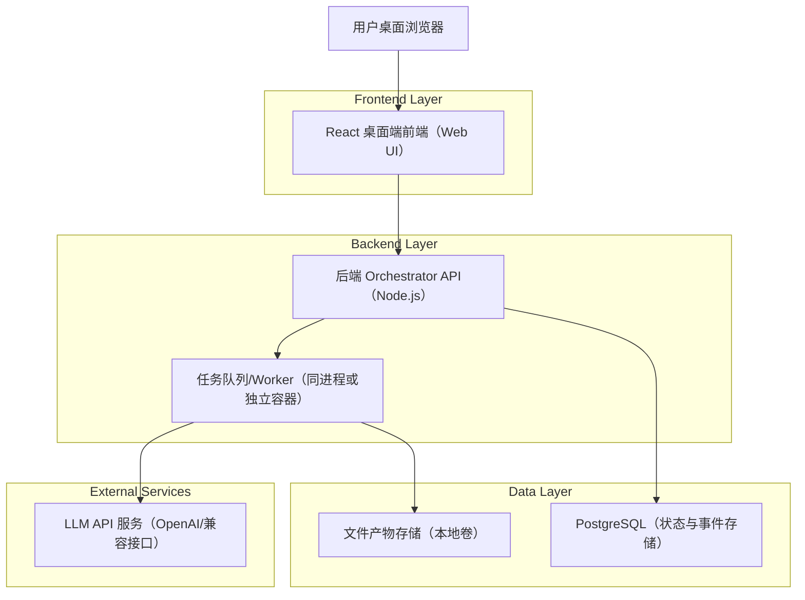
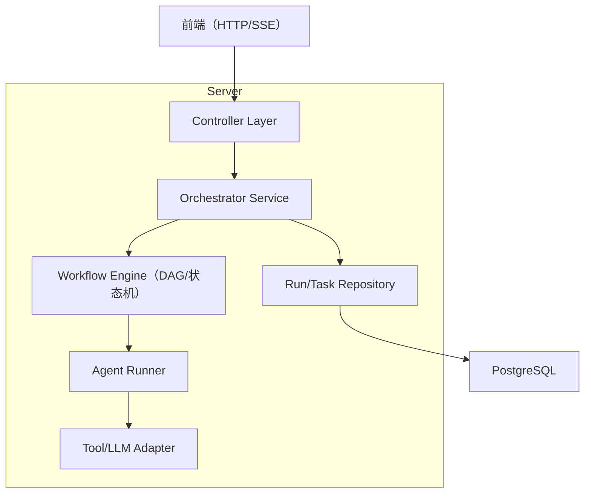
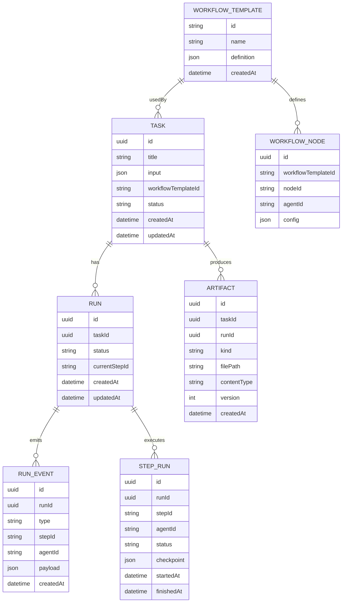

## 1.Architecture design



**关键设计要点（与需求对齐）**
- 多智能体工作流：由 Orchestrator 负责 DAG/状态机驱动；Worker 执行具体智能体步骤（写作、审校、排版等），每步产出事件与检查点。
- 异步暂停/继续/取消：通过“Run 状态 + Step 检查点 + 事件流”实现可恢复执行；取消为幂等终止并写入终止事件。
- 一键 Docker 运行态：提供 docker-compose，默认本地启动前端、后端、PostgreSQL；产物写入挂载卷，便于导出。

## 2.Technology Description
- Frontend: React@18 + TypeScript + Vite + TailwindCSS
- Backend: Node.js@20 + Express@4（REST）+ WebSocket/SSE（事件流）
- Database: PostgreSQL@16
- Queue/Async: BullMQ（Redis 可选；MVP 可用 Postgres 轮询/轻量队列实现）
- LLM: OpenAI-compatible SDK（API Key 仅在后端环境变量中）

## 3.Route definitions
| Route | Purpose |
|-------|---------|
| / | 工作台：任务列表、新建任务、运行态健康、全局设置入口 |
| /tasks/:taskId | 任务详情：配置、工作流可视化、暂停/继续/取消、事件与产物预览 |

## 4.API definitions (If it includes backend services)

### 4.1 Core Types（TypeScript）
```ts
export type TaskStatus = 'draft' | 'running' | 'paused' | 'canceled' | 'succeeded' | 'failed'

export type RunEventType =
  | 'RUN_CREATED'
  | 'RUN_STARTED'
  | 'RUN_PAUSED'
  | 'RUN_RESUMED'
  | 'RUN_CANCELED'
  | 'RUN_SUCCEEDED'
  | 'RUN_FAILED'
  | 'STEP_STARTED'
  | 'STEP_OUTPUT'
  | 'STEP_SUCCEEDED'
  | 'STEP_FAILED'
  | 'CHECKPOINT_SAVED'

export interface Task {
  id: string
  title: string
  input: {
    topic: string
    materials?: string
    targetFormat: 'markdown'
  }
  workflowTemplateId: string
  status: TaskStatus
  createdAt: string
  updatedAt: string
}

export interface Run {
  id: string
  taskId: string
  status: TaskStatus
  currentStepId?: string
  createdAt: string
  updatedAt: string
}

export interface RunEvent {
  id: string
  runId: string
  type: RunEventType
  stepId?: string
  agentId?: string
  payload: Record<string, any>
  createdAt: string
}
```

### 4.2 Core API（REST）
创建任务
```
POST /api/tasks
```
Request:
| Param Name| Param Type | isRequired | Description |
|----------|------------|------------|-------------|
| title | string | true | 任务名称 |
| topic | string | true | 写作主题 |
| materials | string | false | 参考资料/粘贴内容 |
| workflowTemplateId | string | true | 工作流模板 |

启动/控制运行
```
POST /api/tasks/:taskId/runs
POST /api/runs/:runId/pause
POST /api/runs/:runId/resume
POST /api/runs/:runId/cancel
```

事件流（用于前端实时展示）
```
GET /api/runs/:runId/events/stream   (SSE 或 WebSocket)
```

产物
```
GET /api/tasks/:taskId/artifacts
GET /api/artifacts/:artifactId/download
```

## 5.Server architecture diagram (If it includes backend services)


## 6.Data model(if applicable)

### 6.1 Data model definition


### 6.2 Data Definition Language
> 说明：为降低早期迭代成本，外键约束可不启用（应用层保证 taskId/runId 一致性）。

Task Table (tasks)
```
CREATE TABLE tasks (
  id UUID PRIMARY KEY DEFAULT gen_random_uuid(),
  title TEXT NOT NULL,
  input JSONB NOT NULL,
  workflow_template_id TEXT NOT NULL,
  status TEXT NOT NULL,
  created_at TIMESTAMPTZ NOT NULL DEFAULT NOW(),
  updated_at TIMESTAMPTZ NOT NULL DEFAULT NOW()
);

CREATE INDEX idx_tasks_updated_at ON tasks(updated_at DESC);
```

Run Table (runs)
```
CREATE TABLE runs (
  id UUID PRIMARY KEY DEFAULT gen_random_uuid(),
  task_id UUID NOT NULL,
  status TEXT NOT NULL,
  current_step_id TEXT,
  created_at TIMESTAMPTZ NOT NULL DEFAULT NOW(),
  updated_at TIMESTAMPTZ NOT NULL DEFAULT NOW()
);

CREATE INDEX idx_runs_task_id ON runs(task_id);
CREATE INDEX idx_runs_updated_at ON runs(updated_at DESC);
```

Step Run Table (step_runs)
```
CREATE TABLE step_runs (
  id UUID PRIMARY KEY DEFAULT gen_random_uuid(),
  run_id UUID NOT NULL,
  step_id TEXT NOT NULL,
  agent_id TEXT NOT NULL,
  status TEXT NOT NULL,
  checkpoint JSONB,
  started_at TIMESTAMPTZ,
  finished_at TIMESTAMPTZ
);

CREATE INDEX idx_step_runs_run_id ON step_runs(run_id);
CREATE INDEX idx_step_runs_step_id ON step_runs(step_id);
```

Run Event Table (run_events)
```
CREATE TABLE run_events (
  id UUID PRIMARY KEY DEFAULT gen_random_uuid(),
  run_id UUID NOT NULL,
  type TEXT NOT NULL,
  step_id TEXT,
  agent_id TEXT,
  payload JSONB NOT NULL DEFAULT '{}'::jsonb,
  created_at TIMESTAMPTZ NOT NULL DEFAULT NOW()
);

CREATE INDEX idx_run_events_run_id_created_at ON run_events(run_id, created_at ASC);
```

Artifact Table (artifacts)
```
CREATE TABLE artifacts (
  id UUID PRIMARY KEY DEFAULT gen_random_uuid(),
  task_id UUID NOT NULL,
  run_id UUID NOT NULL,
  kind TEXT NOT NULL,
  file_path TEXT NOT NULL,
  content_type TEXT NOT NULL,
  version INT NOT NULL DEFAULT 1,
  created_at TIMESTAMPTZ NOT NULL DEFAULT NOW()
);

CREATE INDEX idx_artifacts_task_id ON artifacts(task_id);
CREATE UNIQUE INDEX uq_artifacts_task_run_version_kind ON artifacts(task_id, run_id, version, kind);
```

Workflow Template Table (workflow_templates)
```
CREATE TABLE workflow_templates (
  id TEXT PRIMARY KEY,
  name TEXT NOT NULL,
  definition JSONB NOT NULL,
  created_at TIMESTAMPTZ NOT NULL DEFAULT NOW()
);
```

## Docker 运行态（桌面 + 一键启动）
**容器建议**
- web：React 前端（静态资源或 dev server）
- api：Orchestrator + Worker（MVP 可同容器）
- db：PostgreSQL
- volumes：artifacts（产物目录挂载到宿主机）

**环境变量建议**
- LLM_API_KEY（仅 api 容器）
- DATABASE_URL（api → db）
- ARTIFACT_DIR（api 写入产物卷